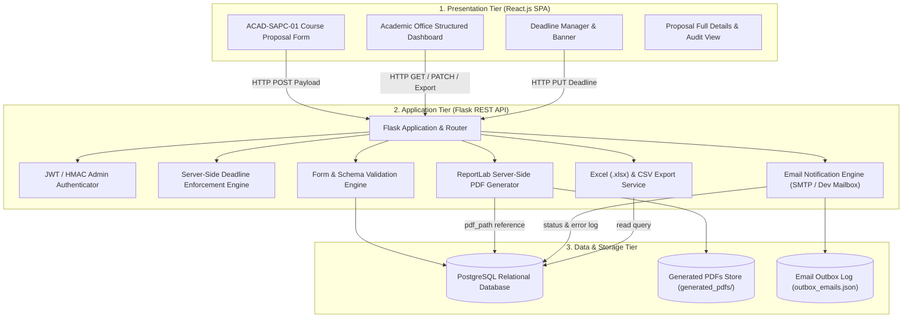

# SAPC Course Proposal System — System Architecture

**Senate Academic Programme Committee (SAPC) — Project 13**  
**Indian Institute of Technology Gandhinagar | Course CS202**

---

## 1. Architectural Overview

The **SAPC Course Proposal System** digitizes the submission, review, tracking, and archival of proposals for new academic courses and modifications to existing courses at IIT Gandhinagar.

The application follows an enterprise-grade **Three-Tier Architecture** ensuring separation of concerns, transactional durability, and high resilience:

---

## 2. Component Breakdown

### 2.1 Presentation Tier (Frontend)
- **Framework**: React.js (Vite build system)
- **Styling**: Academic institutional design conforming to IIT Gandhinagar color standards (Navy `#002147`, Gold `#c29b38`, Slate borders).
- **Core Views**:
  - `CourseProposalForm`: Faithfully mirrors form **ACAD-SAPC-01** with client-side validation, credit calculator, and dynamic conditional fields.
  - `AcademicDashboard`: Replaces the legacy card layout with a structured, database-backed table supporting instantaneous search, multi-attribute filtering, column sorting, and pagination.
  - `DeadlineBanner` & `DeadlineManagerModal`: Displays live submission status, closing timestamp, and administrative controls.
  - `ProposalDetailModal`: Renders complete proposal data and review history.

### 2.2 Application Tier (Backend)
- **Framework**: Python 3.12 / Flask 3.1
- **API Architecture**: RESTful JSON endpoints grouped into modular Blueprints:
  - `/api/proposals`: Proposal creation, querying, detail view, status update, PDF retrieval.
  - `/api/deadline`: Public deadline status, administrative adjustments, and boundary evaluation.
  - `/api/proposals/export`: Streaming Excel (`.xlsx`) and CSV generation.
  - `/api/auth`: Administrator login, session token validation, and email outbox inspection.
- **Server-Side Validation**:
  - Independent validation of mandatory fields, character lengths, and regex patterns.
  - Strict server-side deadline boundary check (submissions rejected after deadline with HTTP 403).
  - Duplicate submission detection based on course title and proposer name.
- **PDF Generation Service**:
  - Uses ReportLab Platypus engine.
  - Generates official ACAD-SAPC-01 documents with two-pass canvas (`Page X of Y`), table grids, wrapped paragraphs, and institutional headers.
- **Email Notification Service**:
  - Automatically notifies the proposer/faculty email address upon submission.
  - **Fault Resilience**: Email failures are captured, logged in `email_notification_status` and `email_error_log`, without rolling back or invalidating the submitted proposal record.

### 2.3 Data Tier
- **Relational Database**: PostgreSQL (production) with dual SQLite capability for zero-configuration local development.
- **Indexes**: Applied to commonly queried fields (`proposal_id`, `course_title`, `proposer_name`, `faculty_email`, `status`, `submission_date`).
- **File System**: `generated_pdfs/` stores rendered PDF artifacts referenced by relative path in the database.
