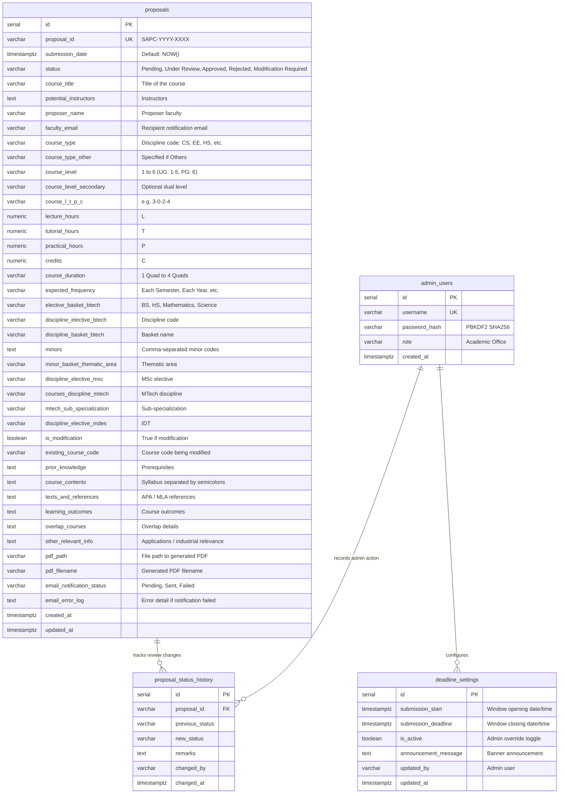

# SAPC Course Proposal System — Database Architecture & Schema Specification

**Senate Academic Programme Committee (SAPC) — Project 13**  
**Indian Institute of Technology Gandhinagar**

---

## 1. Entity-Relationship Diagram



---

## 2. Table Specifications

### 2.1 `proposals`
The core table storing course proposals submitted through Form **ACAD-SAPC-01**.

- **Primary Key**: `id` (Serial integer)
- **Unique Identifier**: `proposal_id` (`VARCHAR(50)`, format `SAPC-YYYY-XXXX`)
- **Status Constraints**: Values restricted to `'Pending'`, `'Under Review'`, `'Approved'`, `'Rejected'`, `'Modification Required'`.
- **Notification Tracking**: `email_notification_status` records whether automated email transmission succeeded (`'Sent'`), was logged locally (`'Sent'`), or failed (`'Failed'`).

### 2.2 `deadline_settings`
Maintains the submission window parameters configured by the Academic Office:
- `submission_start`: Starting timestamp in UTC.
- `submission_deadline`: Hard cutoff timestamp in UTC. Submissions attempted at `current_time > submission_deadline` are blocked on the server.
- `is_active`: Emergency administrative switch allowing instant opening or closing regardless of the calendar window.

### 2.3 `admin_users`
Stores Academic Office authorized accounts. Passwords are encrypted using salted PBKDF2 with SHA-256 (`generate_password_hash`).

### 2.4 `proposal_status_history`
Full audit log tracking state transitions for proposals as they move through the review pipeline:
- Links to `proposals.proposal_id` with `ON DELETE CASCADE`.
- Captures `previous_status`, `new_status`, administrative `remarks`, and `changed_by`.

---

## 3. Query Optimization and Indexes

To guarantee sub-millisecond query performance on dashboards with large proposal volumes, B-Tree indexes are applied to all queried attributes:

```sql
CREATE INDEX idx_proposals_proposal_id ON proposals(proposal_id);
CREATE INDEX idx_proposals_course_title ON proposals(course_title);
CREATE INDEX idx_proposals_proposer_name ON proposals(proposer_name);
CREATE INDEX idx_proposals_faculty_email ON proposals(faculty_email);
CREATE INDEX idx_proposals_status ON proposals(status);
CREATE INDEX idx_proposals_submission_date ON proposals(submission_date);
CREATE INDEX idx_proposals_course_type ON proposals(course_type);
CREATE INDEX idx_proposals_course_level ON proposals(course_level);
CREATE INDEX idx_proposals_is_modification ON proposals(is_modification);
```
